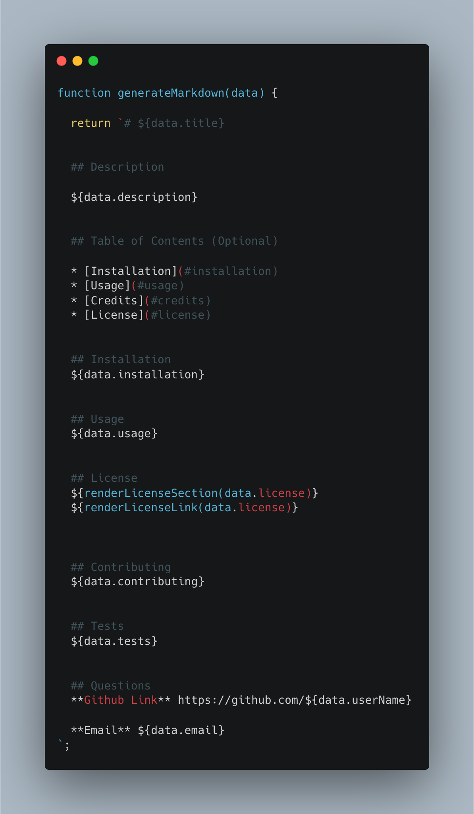

# Master READ-ME

## Technology Used 

|Technology | Resource |
|-----|:-----------
| JavaScript | [https://developer.mozilla.org/](https://developer.mozilla.org/en-US/docs/Web/JavaScript) |
| Node.js |[https://developer.mozilla.org/en-US/docs/Glossary/Node.js](https://developer.mozilla.org/en-US/docs/Glossary/Node.js)|

## Description

This app produces a README.md file that is populated using a user responses to prompts in the terminal. 

[Watch the video walk-through here](https://drive.google.com/file/d/1pxjzF0KV838qoABcZWGIZmnwwWqdQ6jG/view)

## Table of Contents
* [Learning Points](#learning-points)
* [Author Info](#author-info)
* [Credits](#credits)
* [License](#license)

## Learning Points
### Template strings
Template strings in the below function generate text used to write the output file. 

## Author Info

### Henner Espinoza

* [LinkedIn](https://www.linkedin.com/in/hennerespinoza)

* [GitHub](https://github.com/justhenner)

## Credits

* Study group members

## License

MIT License